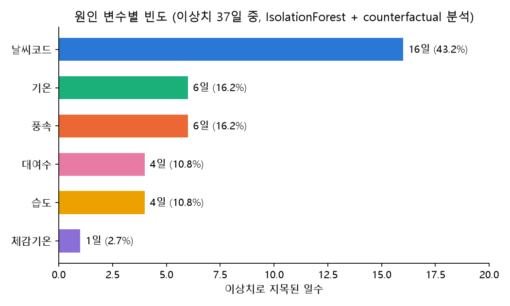
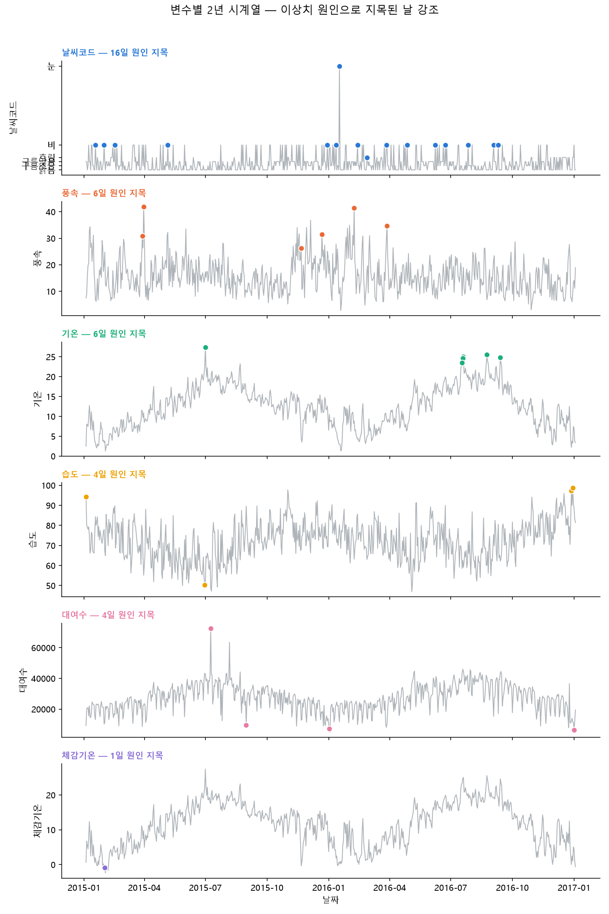

# 런던 자전거 대여 수요 회귀분석 (Train=2015 -> Test=2016)

`01-washington`에서 검증한 STEP 0~13 범용 회귀분석 파이프라인을 런던 자전거 공유
데이터에 적용한 결과다. **2015년 일별 데이터로 학습해 2016년 일별 대여량(`cnt`)을
예측**하고, 가장 일반화 성능이 좋은 모델을 채택했다.

계획 문서: [`docs/london_regression_analysis_plan.md`](docs/london_regression_analysis_plan.md)
(참고 기준 요약·결정 사항 전체), [`docs/hourly_to_daily_aggregation_rules.md`](docs/hourly_to_daily_aggregation_rules.md),
[`docs/london_hourly_to_daily_conversion_plan.md`](docs/london_hourly_to_daily_conversion_plan.md)
(시간별 -> 일별 변환 근거).

## 설치

```bash
pip install -r requirements.txt
```

## 데이터

| 구분 | 파일 | 행 수 |
|---|---|---|
| Train | `data/processed/london_daily_2015.csv` | 362일 |
| Test | `data/processed/london_daily_2016.csv` | 365일 |

원본 `data/london_merged.csv`(시간별, 17,414행)를 규칙에 따라 일별로 집계했고,
2017년 3일치는 제외했다. `src/preprocessing.py`로 재확인한 결과 Train/Test 모두
결측치·중복 0건이었고, IQR 이상치는 전부 실제 관측값(폭염/강풍 등)으로 판단해 별도
보정 없이 그대로 사용했다.

## STEP 0: 최종 스키마 (VIF 실측 반영)

`src/regression.py`에서 Train(2015) 기준으로 다중공선성(VIF)을 실측한 뒤 확정했다.

```
TARGET = "cnt"
NOMINAL_COLS = ["mnth", "weekday", "weather_code"]   # 원-핫 인코딩
BINARY_NUMERIC_COLS = ["is_holiday"]
CONTINUOUS_COLS = ["t1", "hum", "wind_speed"]
DROP_COLS = ["instant", "dteday", "yr", "n_hours_recorded",
             "season", "is_weekend", "workingday", "t2"]
```

**VIF 실측 결과 (Train=2015, statsmodels)**

| 라운드 | 발견 | 조치 |
|---|---|---|
| 1차 | `is_holiday`/`is_weekend`/`workingday`, `season`/`mnth` 계열 전부 VIF=inf | `season`(월에서 100% 결정), `workingday`(휴일+주말로 100% 결정), `is_weekend`(요일 원-핫과 완전 선형종속) 제거 |
| 2차 | `t1`=127.2, `t2`=124.9 (상관계수 0.99) | `t2` 제거, `t1`만 유지 |
| 3차(최종) | 잔여 변수 최대 VIF=5.29(`t1`) | 전부 5 이하로 통과 |

워싱턴의 `workingday`(VIF=inf) / `atemp`(VIF≈650) 제거 사례와 동일한 패턴이 런던
데이터에서도 실측으로 재확인됐다.

**참고 — `weather_code=26`(눈) 처리**: Train(2015)엔 0건, Test(2016)엔 1건만 존재한다.
`build_design_matrix()`가 train+test를 합쳐서 원-핫 인코딩한 뒤 다시 분리하는
방식으로, Train에서 한 번도 못 본 범주 때문에 예측이 깨지는 문제를 막았다(해당
컬럼은 Train에서 분산 0이라 계수가 0으로 추정됨).

## 결과 (Test=2016년 365일 기준)

| 모델 | 테스트 R² | 테스트 RMSE | 테스트 MAE |
|---|---|---|---|
| **Ridge (튜닝, α=10)** | **0.7713** | **4168.2** | 3171.8 |
| 선형회귀 (OLS) | 0.7685 | 4194.1 | **3164.0** |
| Lasso (튜닝, α≈177.8) | 0.7567 | 4299.7 | 3324.9 |
| XGBoost (튜닝) | 0.7231 | 4587.2 | 3495.4 |
| XGBoost (기본) | 0.7074 | 4715.2 | 3675.7 |
| XGBoost (강한 정규화) | 0.6396 | 5233.1 | 4200.0 |
| Random Forest (기본/튜닝 동일) | 0.6685 | 5018.4 | 3968.9 |
| Random Forest (강한 정규화) | 0.5700 | 5716.0 | 4681.9 |

**최종 채택 모델: Ridge (α=10, 그리드서치 튜닝)** — Test R²=0.7713로 8개 설정 중 최고.

> **워싱턴과 정반대 결과**: 워싱턴에서는 튜닝 XGBoost(R²=0.727)가 선형 계열을
> 앞섰지만, 런던에서는 **선형 계열(Ridge/OLS)이 트리 계열(RF/XGBoost)을 모두
> 앞섰다.** 원인으로 보이는 것은 학습 데이터 크기다 — 워싱턴은 585일을 학습에
> 썼지만 런던은 요청대로 "2015년 전체"만 학습에 써서 362일뿐이었다. 실제로
> `tune_random_forest.py`의 Train 내부 시간순 교차검증(`TimeSeriesSplit`, 5-fold,
> fold당 약 60일)에서 평균 R²가 **-0.1547**로 나올 만큼 트리 모델의 내부 검증
> 자체가 불안정했다. 표본이 작을수록 트리 앙상블은 분산이 커지고, 선형모델은
> 상대적으로 안정적이라는 일반적 경향이 그대로 재현된 것으로 판단된다.

## 최종 예측: 2016년 `cnt` (Ridge α=10)

`src/predict_2016.py`로 Train(2015) 전체로 Ridge를 재학습해 2016년 365일을
예측했다. 결과: `data/processed/london_daily_2016_predictions.csv`.

- 24시간 온전히 기록된 날(349일) 평균 절대오차: **3104.7**
- 24시간 미만으로 기록된 날(16일) 평균 절대오차: **4635.5** — 계획안에서 미리
  우려했던 대로, `cnt`가 부분 합계인 날에 오차가 더 크게 나타남을 실측으로 확인
- 오차 최상위 사례: 2016-12-25(크리스마스, 공휴일인데 실제 대여량이 예측보다
  훨씬 높음, 잔차 +23,191), 2016-06-24(브렉시트 국민투표 결과 발표일, 9시간만
  기록된 부분일이라 실제값 자체가 낮게 집계됐는데 모델은 이를 몰라 과대예측,
  잔차 -17,330)

## 보조 EDA: 이상치 탐지 (Isolation Forest)

회귀 파이프라인과 별개로 전체 기간(2015-01-04~2017-01-03, 730일)에서 "평소와
다른 날"을 탐지했다. 워싱턴과 동일한 방법(`IsolationForest`,
`n_estimators=300, contamination=0.05` + counterfactual 민감도 분석).

730일 중 **37일(5.1%)**이 이상치로 탐지됐고, 원인 변수 빈도는 다음과 같다.

| 원인 변수 | 일수 | 비율 |
|---|---|---|
| 날씨코드(`weather_code`) | 16일 | 43.2% |
| 기온(`t1`) | 6일 | 16.2% |
| 풍속(`wind_speed`) | 6일 | 16.2% |
| 대여수(`cnt`) | 4일 | 10.8% |
| 습도(`hum`) | 4일 | 10.8% |
| 체감기온(`t2`) | 1일 | 2.7% |

`weather_code`가 워싱턴 때와 마찬가지로 1위인데, 이번엔 비중이 낮아졌다(워싱턴
56.8% vs 런던 43.2%) — 대신 `t1`/`wind_speed`가 골고루 원인으로 등장해, 런던
데이터에서는 이상치 판정이 날씨 코드 하나에 덜 쏠려 있다.

| 원인 변수별 빈도 | 변수별 2년 시계열 + 이상치 강조 |
|---|---|
|  |  |

## 실행

```bash
cd src
python preprocessing.py         # STEP1 재확인 (결측/중복/이상치 상태 출력, 데이터 변경 없음)
python regression.py            # OLS (Train=2015 적합, Test=2016 평가, VIF 근거 포함)
python random_forest.py         # Random Forest (2015+2016 전체 적합, 참고용)
python xgboost_model.py         # XGBoost (전체 적합 + Train->Test 평가)
python train_test_eval.py       # 선형회귀 vs Random Forest, Train->Test 비교
python tune_linear.py           # Ridge/Lasso 튜닝 (최종 채택 모델 산출)
python tune_random_forest.py    # Random Forest 튜닝
python tune_xgboost.py          # XGBoost 튜닝
python predict_2016.py          # 최종 모델(Ridge)로 2016년 예측 + 잔차 분석
python anomaly_detection.py     # IsolationForest 이상치 탐지 (전체 730일)
python plot_anomalies.py        # 이상치 탐지 시각화 PNG 생성
```

## 폴더 구조

```
data/
  london_merged.csv                    # 원본 (시간별, 수정 안 함)
  processed/london_daily.csv           # 일별 변환 결과 (730일)
  processed/london_daily_2015.csv      # Train
  processed/london_daily_2016.csv      # Test
  processed/london_daily_2016_predictions.csv  # 최종 예측+잔차
  processed/london_daily_anomalies.csv # 이상치 탐지 결과 (37행)
src/
  hourly_to_daily.py / split_daily_by_year.py   # 시간별 -> 일별/연도별 변환
  preprocessing.py                     # STEP1 재확인
  regression.py                        # STEP0, 4~7, 10~11: OLS + build_design_matrix
  random_forest.py / xgboost_model.py  # Random Forest / XGBoost
  train_test_eval.py                   # OLS vs RF, Train->Test 비교
  tune_linear.py / tune_random_forest.py / tune_xgboost.py  # 하이퍼파라미터 튜닝
  predict_2016.py                      # 최종 모델로 2016년 예측
  anomaly_detection.py / plot_anomalies.py       # 이상치 탐지 (보조 EDA)
figures/
  anomaly_cause_frequency.png
  anomaly_variable_timeseries.png
docs/
  hourly_to_daily_aggregation_rules.md
  london_hourly_to_daily_conversion_plan.md
  london_regression_analysis_plan.md
```

## 이 프로젝트의 접근 방식

이 프로젝트도 워싱턴과 마찬가지로 Claude Code를 분석 파트너로 활용해 진행했다.
다만 사전 지침 문서 한 벌로 시작한 워싱턴과 달리, 국면이 바뀔 때마다 계획 문서를
새로 쓰고 승인받은 뒤 실행하는 방식으로 진행됐다. 자세한 워크플로우는
[`docs/claude_code_workflow.md`](docs/claude_code_workflow.md)를 참고.

## 워싱턴과 다른 지점 요약

- Train/Test가 워싱턴처럼 비율(80/20)이 아니라 **연도 단위 고정 분할**(요청사항)
- 워싱턴엔 없던 `n_hours_recorded`(하루 기록 시간 수)를 파생해 부분 합계 날짜를
  추적, 모델 입력에선 제외하되 잔차 분석에 활용
- `weather_code`의 일별 대표값(최빈값) 규칙은 런던에 대조용 일별 정답 파일이 없어
  검증 불가능한 근사 규칙 — 다른 컬럼보다 신뢰도가 낮음을 감안해 해석
- 최종 채택 모델이 워싱턴(XGBoost)과 달리 **Ridge(선형)** — 학습 표본이 작을 때
  트리 앙상블보다 정규화 선형모델이 더 안정적으로 일반화한다는 것을 실측으로 확인
