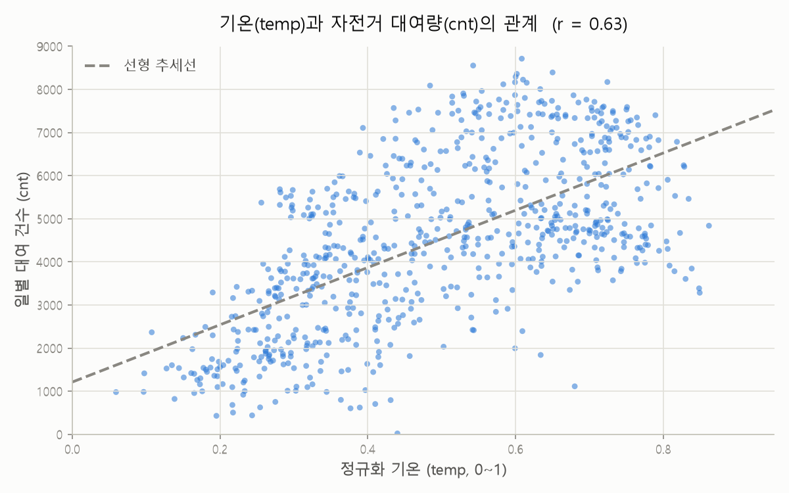
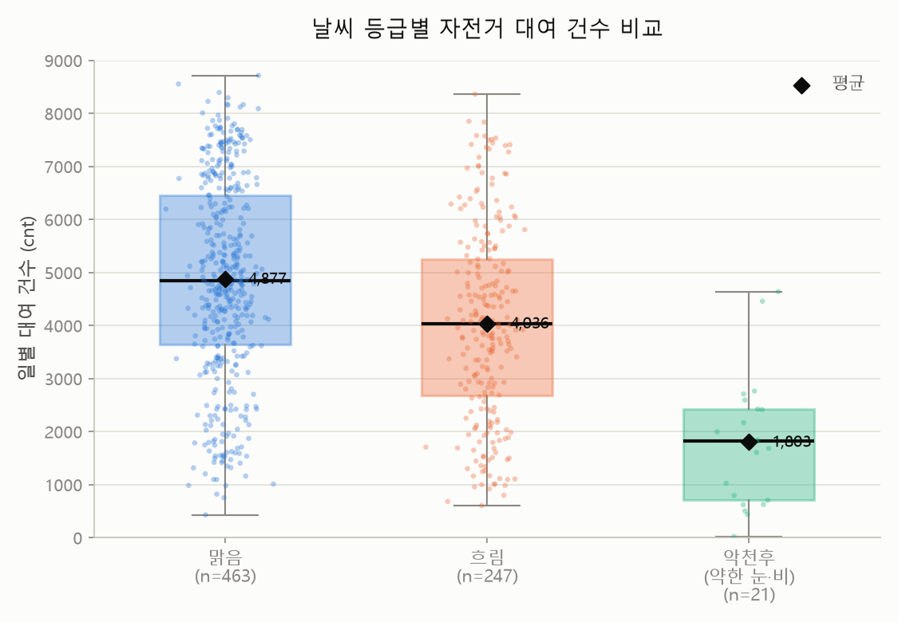
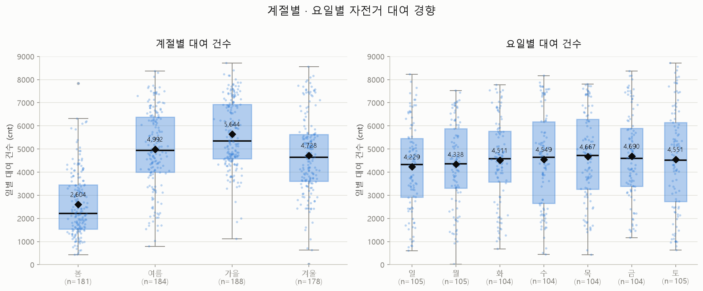

# 정형 데이터 회귀분석 범용 파이프라인 (예시: Bike Sharing Demand)

특정 데이터셋 하나만을 위한 일회성 분석 스크립트가 아니라, **연속형 타겟을 가진 정형(tabular)
데이터셋이라면 어디에든 재사용 가능한 전처리·회귀분석 파이프라인**입니다. STEP 0에서 정의하는
5개의 스키마 상수만 바꾸면 전처리 → EDA → 다중공선성 점검 → 모델링(선형회귀/Ridge/Lasso/
Random Forest/XGBoost) → 시간순 train/test 평가까지 동일한 코드 흐름을 새 데이터셋에 그대로
적용할 수 있습니다.

이 저장소에는 이 파이프라인을 **UCI Bike Sharing Dataset(`day.csv`)**에 실제로 적용한 결과가
고정 예시(fixed example)로 포함되어 있습니다 — 파이프라인이 실제로 어떻게 동작하는지 보여주는
실행 가능한 참조 사례입니다.

## 핵심 설계: 가변 데이터셋 / 고정 파이프라인

| 구분 | 내용 | 데이터셋이 바뀌면? |
|---|---|---|
| **가변(variable)** | `TARGET`, `DATE_COL`, `CATEGORICAL_COLS`, `NUMERIC_COLS`, `DROP_COLS` (STEP 0 상수) | 새 데이터셋 스키마에 맞게 수정 |
| **고정(fixed)** | 전처리 로직 뼈대, 다중공선성 점검, 시간순 train/test 분할, 모델 학습/평가 함수 | 코드 수정 없이 그대로 재사용 |

```python
# src/preprocessing.py, src/regression.py STEP 0
TARGET = "cnt"            # 예측 대상 컬럼
DATE_COL = "dteday"       # 시간순 정렬 기준 컬럼
CATEGORICAL_COLS = ["season", "yr", "mnth", "holiday", "weekday", "workingday", "weathersit"]
NUMERIC_COLS = ["temp", "atemp", "hum", "windspeed"]
DROP_COLS = ["instant", "casual", "registered"]  # 식별자 + 데이터 누수 변수
```

다른 데이터셋에 적용하는 전체 절차(단계별 목적·근거 포함)는 [`docs/methodology.md`](docs/methodology.md)
의 "다른 데이터셋에 적용하는 방법" 절을 참고하세요.

## 폴더 구조

```
data/
  raw/day.csv                # 원본 데이터 (예시 데이터셋 — 교체 가능)
  processed/day_preprocessed.csv
src/
  preprocessing.py           # STEP 0~9: 결측치/이상치 처리
  regression.py               # STEP 6, 10~11: OLS 선형회귀 + 설계행렬 생성(build_design_matrix)
  train_test_eval.py         # STEP 9: 시간순 train/test 분할 + 공통 평가 함수(evaluate)
  random_forest.py           # Random Forest 회귀
  xgboost_model.py            # XGBoost 회귀
  tune_linear.py              # Ridge/Lasso 하이퍼파라미터 튜닝
  tune_random_forest.py      # Random Forest 하이퍼파라미터 튜닝
  tune_xgboost.py             # XGBoost 하이퍼파라미터 튜닝
docs/
  methodology.md              # STEP 0~13 방법론 상세 설명 + 다른 데이터셋 적용 가이드
  claude_code_workflow.md    # Claude Code를 분석 파트너로 활용한 작업 기록
figures/                      # EDA 시각화 결과
requirements.txt
```

## 설치

```bash
git clone <repo-url>
cd bike-sharing-demand-portfolio
python -m venv .venv
.venv\Scripts\activate   # Windows (macOS/Linux: source .venv/bin/activate)
pip install -r requirements.txt
```

## 사용법

### 1) 포함된 예시 데이터셋(day.csv)으로 바로 실행

```bash
cd src
python preprocessing.py        # data/processed/day_preprocessed.csv 생성
python regression.py           # OLS 선형회귀 (전체 데이터 적합)
python random_forest.py        # Random Forest (전체 데이터 적합)
python xgboost_model.py        # XGBoost (전체 적합 + 시간순 train/test)
python train_test_eval.py      # 선형회귀 vs Random Forest, 시간순 train/test 비교
python tune_linear.py          # Ridge/Lasso 튜닝
python tune_random_forest.py   # Random Forest 튜닝
python tune_xgboost.py         # XGBoost 튜닝
```

### 2) 다른 데이터셋에 적용하기

1. `data/raw/`에 새 CSV를 넣습니다.
2. `src/preprocessing.py`, `src/regression.py`의 STEP 0 상수(`TARGET`, `DATE_COL`,
   `CATEGORICAL_COLS`, `NUMERIC_COLS`, `DROP_COLS`)를 새 데이터셋 스키마에 맞게 수정합니다.
3. STEP 1(EDA) 결과를 보고 결측치·이상치 처리 방식(`preprocessing.py`)을 데이터 특성에 맞게
   조정합니다.
4. 다중공선성 점검, 인코딩, 시간순 train/test 분할, 모델링, 평가 로직은 코드 수정 없이 그대로
   재사용됩니다.
5. 타겟이 연속형일 때만 적용 가능합니다 — 타겟이 이진/범주형이면 회귀가 아닌 분류 문제이므로
   별도 가이드가 필요합니다.

단계별 상세 목적·근거는 [`docs/methodology.md`](docs/methodology.md)를 참고하세요.

## 예시 데이터셋: Bike Sharing Demand

- 출처: UCI Bike Sharing Dataset (`day.csv`, 일별 집계, 731행)
- 타겟: `cnt` (일별 자전거 대여 총량)
- 주요 전처리 판단
  - `hum=0`(습도 0%, 악천후 기록인데 물리적으로 모순) → 결측으로 간주 후 시계열 선형 보간
  - `casual`/`registered`(합산하면 `cnt`가 되는 데이터 누수 변수) 제거
  - `workingday`(VIF=inf, `weekday`+`holiday`로 완전히 결정되는 파생변수), `atemp`(VIF≈650,
    `temp`와 거의 동일한 정보) 다중공선성으로 제거

### 주요 시각화

| | | |
|---|---|---|
|  |  |  |

## 결과 (day.csv 기준, 시간순 train/test 분할 — 학습 585일 / 테스트 146일)

| 모델 | 테스트 R² | 테스트 RMSE | 테스트 MAE |
|---|---|---|---|
| 선형회귀 (OLS) | 0.653 | 1106.1 | 803.0 |
| Ridge (튜닝, α=10) | 0.651 | 1108.8 | 821.4 |
| Lasso (튜닝, α≈31.6) | 0.607 | 1177.0 | 944.4 |
| Random Forest (기본) | 0.501 | 1326.6 | 1115.8 |
| Random Forest (튜닝) | 0.502 | 1324.7 | 1131.7 |
| XGBoost (기본) | 0.567 | 1235.5 | 1035.4 |
| **XGBoost (튜닝)** | **0.727** | **980.8** | **804.6** |

> **전체 데이터 적합 R²만으로 모델을 비교하면 안 되는 이유**: 전체 데이터에 그대로 적합했을 때는
> Random Forest(R²=0.98)가 선형회귀(R²=0.86)보다 훨씬 우수해 보이지만, 이는 과적합 때문입니다.
> 시간순으로 학습/테스트를 분리하면 순위가 뒤집혀(선형회귀 0.65 > 기본 RF 0.50) 이 사실이
> 드러납니다. 정규화 선형모델(Ridge/Lasso)로 "선형회귀만 튜닝을 안 해서 불공정한 것 아니냐"는
> 우려도 검증했으며, 결과는 OLS와 거의 동일했습니다. 하이퍼파라미터 그리드서치를 거친 XGBoost가
> 최종적으로 가장 우수한 일반화 성능(R²=0.727)을 보였습니다.

## 이 프로젝트의 접근 방식

이 프로젝트는 Claude Code(CLI 기반 AI 코딩 에이전트)를 분석 파트너로 활용해 진행했으며, 각
단계의 실행 결과를 사람이 직접 검토·승인하는 방식으로 수행했습니다. 자세한 워크플로우는
[`docs/claude_code_workflow.md`](docs/claude_code_workflow.md)를 참고하세요.

## 기술 스택

pandas, numpy, scikit-learn, statsmodels, xgboost, matplotlib, seaborn
